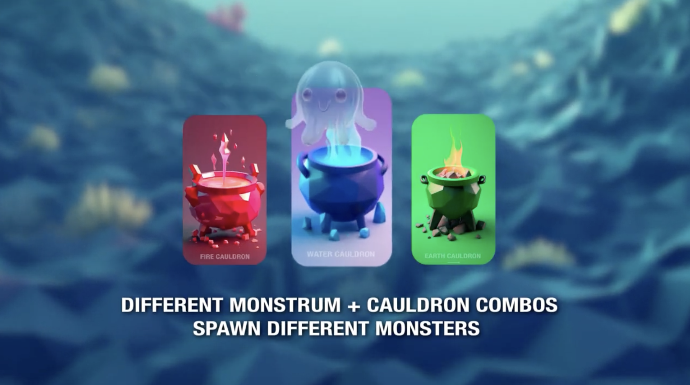

# 🏆 Fuzzle

## Project Overview

Fuzzle is an innovative, blockchain-based monster collection and breeding game built on the Aptos blockchain. Players can create, collect, breed, and trade unique digital monsters ("Fuzzles") with distinct genetics and elemental properties, all fully owned on-chain. The project combines dynamic gameplay, robust technology, and augmented reality to offer a next-generation web3 gaming experience.

## Demo

Click the image above to see Fuzzle in action: create, infuse, and breed monsters using advanced blockchain mechanics.

---

### Key Features

- **Monster Creation:** Generate Fuzzles with unique traits and characteristics.
- **Elemental Infusion:** Infuse monsters with elemental properties (Fire, Water, Earth) using cauldrons.
- **Monster Breeding:** Breed two monsters to create new Fuzzles with blended or mutated traits.
- **Monster Collection:** View and interact with your monster inventory and genetics.
- **Trading System:** Peer-to-peer trading of Fuzzles via smart contracts.
- **Augmented Reality:** Instantly view and share your Fuzzles in real-world settings via Apple's USDZ format AR.

---

### Technologies

- **Frontend:** Next.js, Tailwind CSS, AR via HTML+USDZ
- **Blockchain:** Aptos blockchain using Move language smart contracts
- **Marketplace & Social:** On-chain trading and collection management

---

## Hackathon Achievement

- **Built for:** Aptos Hackathon Delhi, Sept 24-25 @ Maidens Crown Banquet, Delhi
- **Prize Pool:** Competing for $15,000+ | 24 hour IRL build sprint
- **Team:** Code Warrior

---

## Technical Details

### Smart Contract Architecture

Fuzzle's core smart contracts (written in Move) handle:
- **Creation:** Modular, extensible design for Fuzzle genetics and rarity
- **Infusion:** Add or blend elemental types securely on-chain
- **Breeding:** Sophisticated inheritance and mutation logic for new Fuzzle creation

### Frontend Architecture

- **Main Page:** Petri dish with spores and cauldrons for live gameplay
- **Monster Detail:** Interactive stats, AR integration, and trait explorer
- **Marketplace:** Trade and discover rare Fuzzles on-chain

### Augmented Reality Integration

- USDZ model files let anyone view their Fuzzles in 3D AR on supported devices
- Simple HTML redirect launches the AR experience

---

## Future Development

- New monster classes, elemental types, and battle mechanics
- Expanded, mobile-first experience for wider player engagement
- Full on-chain NFT marketplace with staking and rewards
- Multi-chain and cross-game compatibility

---

## About

"Fuzzle" is a showcase of creative game mechanics and blockchain engineering by Team Code Warrior, built in just 24 hours at the Aptos Hackathon Delhi 2025.

---

## License

MIT License

---

*Built with ❤️ at Aptos Hackathon Delhi, inspired by the Mojo Monsters framework and adapted for the next era of web3 gaming.*
